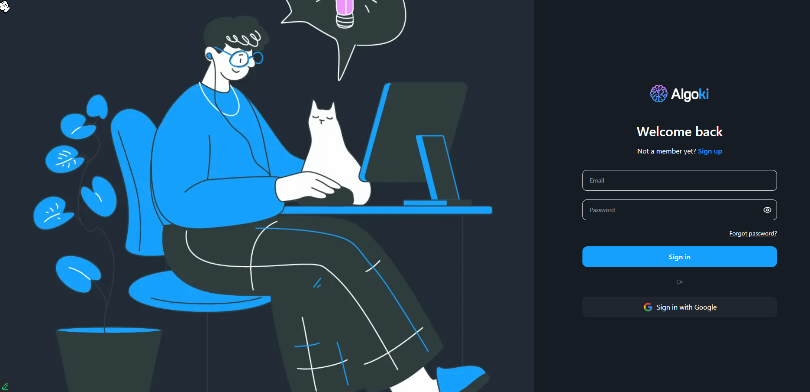

# 🎓 Algoki – Nền Tảng Giáo Dục Trực Tuyến Hiện Đại!

## 📌 Giới thiệu tổng quan

Algoki là nền tảng giáo dục trực tuyến chuyên biệt cung cấp các **khóa học lập trình và kỹ năng số** dành cho mọi đối tượng học viên, với phương pháp học tập hiện đại, tương tác và cá nhân hóa. Hệ thống quản lý học tập thông minh, trình soạn thảo code trực tuyến và trải nghiệm người dùng tối ưu.

> 🎯 "Học mọi lúc, mọi nơi – Phát triển tài năng, khơi dậy đam mê lập trình!"

---

## 🎯 Mục tiêu chính

- **Cung cấp nền tảng học lập trình hiện đại** với các khóa học chất lượng cao
- Xây dựng **lộ trình học tập cá nhân hóa** phù hợp với từng trình độ và mục tiêu
- Hỗ trợ **giảng viên và học viên** trong việc tạo nội dung và theo dõi tiến trình học tập
- Phát triển **kỹ năng lập trình thực tế** thông qua bài tập và dự án thực hành

---

## 🔗 Links

- **🌐 Website**: [Algoki Platform](https://algoki.vercel.app)
- **📹 Demo Video**: [Xem Demo](https://drive.google.com/drive/u/0/folders/1H63cGOYzlO99d_DonZneAm0rM76HBR5m)

---

## 🧩 Tính năng chính

### ✅ 1. Hệ thống đăng ký & xác thực

- **Đăng ký tài khoản** với email/mật khẩu hoặc Google OAuth 
- **Xác thực email** qua mã OTP 6 chữ số
- **Quên mật khẩu** và đặt lại mật khẩu mới
- **Đăng nhập Google** tích hợp với @react-oauth/google
- Giao diện thân thiện cho cả giảng viên và học viên
- **Validation động** với Zod schema và React Hook Form
- **Bảo mật JWT** với HttpOnly cookies cho phiên đăng nhập an toàn
- **Phân quyền người dùng** (Student, Instructor, Admin)

---

### 📚 2. Hệ thống khóa học & quản lý nội dung

- **Danh mục khóa học**: Phân loại theo chủ đề, độ khó và ngôn ngữ lập trình
- **Chi tiết khóa học**: Mô tả chi tiết, yêu cầu và kết quả học tập mong đợi
- **Course Builder**: Công cụ tạo khóa học với CKEditor5 và upload video
- **Course Status Management**: Xuất bản, Lưu trữ, Nháp với workflow hoàn chỉnh
- **Module & Lesson Management**: Tạo chương và bài học chi tiết với nhiều loại nội dung
- **Preview Video**: Video giới thiệu khóa học trước khi mua
- **Thumbnail & Media**: Quản lý hình ảnh và video cho khóa học
- **Pricing System**: Hệ thống định giá linh hoạt với giá gốc và giá khuyến mãi
- **Course Categories**: Phân loại khóa học theo chủ đề và ngôn ngữ lập trình

---

### 🎮 3. Hệ thống bài học đa dạng & tương tác

- **Video Lessons**: Bài học video với React Player và tính năng bookmark
- **Document Lessons**: Bài học dạng tài liệu với CKEditor5 và Markdown
- **Interactive Quizzes**: Hệ thống quiz với nhiều dạng câu hỏi và chấm điểm tự động
- **Code Exercises**: Bài tập lập trình với Sandpack React và CodeMirror
- **Multi-language Support**: Hỗ trợ nhiều ngôn ngữ lập trình (Java, C++, Python, JavaScript)
- **Real-time Code Execution**: Chạy và kiểm tra code trực tuyến
- **Progress Tracking**: Theo dõi tiến trình học tập chi tiết
- **Lesson Notes**: Ghi chú cá nhân cho từng bài học
- **Completion Status**: Đánh dấu hoàn thành và theo dõi tiến độ

---

### 👨‍🎓 4. Dashboard học viên

- **Tổng quan học tập**: Thống kê khóa học đã đăng ký, đang học, đã hoàn thành
- **My Courses**: Danh sách khóa học với tiến trình học tập chi tiết
- **Learning Progress**: Theo dõi tiến độ học tập với biểu đồ và thống kê
- **Hồ sơ cá nhân**: Chỉnh sửa thông tin, avatar, cài đặt cá nhân
- **Favorites**: Quản lý khóa học yêu thích
- **Test Scores**: Lịch sử điểm kiểm tra và bài thi chi tiết
- **Reviews**: Đánh giá và nhận xét về khóa học đã học
- **Purchase History**: Lịch sử mua khóa học và giao dịch
- **Settings**: Cài đặt tài khoản và thông báo

---

### 👨‍🏫 5. Dashboard giảng viên

- **Course Management**: Quản lý các khóa học đã tạo với dashboard chi tiết
- **Content Creation**: Tạo và chỉnh sửa bài học, quiz, bài tập
- **Student Analytics**: Theo dõi tiến trình học tập của học viên
- **Revenue Tracking**: Theo dõi doanh thu và thống kê bán hàng với Recharts
- **Category Management**: Quản lý danh mục khóa học
- **Exercise Management**: Tạo và quản lý bài tập lập trình
- **Test Management**: Tạo và quản lý bài kiểm tra
- **Purchase Approval**: Duyệt các yêu cầu mua khóa học
- **Notifications**: Nhận thông báo về khóa học và học viên

---

### 🏆 6. Hệ thống theo dõi & đánh giá

- **Progress Analytics**: Thống kê chi tiết tiến trình học tập
- **Score Management**: Quản lý điểm số và kết quả bài kiểm tra
- **Attempt Tracking**: Theo dõi các lần làm bài và lịch sử
- **Real-time Results**: Hiển thị kết quả ngay sau khi hoàn thành
- **Rating System**: Hệ thống đánh giá khóa học với @smastrom/react-rating
- **Review System**: Đánh giá và phản hồi từ học viên
- **Completion Certificates**: Chứng chỉ hoàn thành khóa học
- **Learning Analytics**: Phân tích hành vi học tập

---

### 🛒 7. Hệ thống thương mại điện tử

- **Shopping Cart**: Giỏ hàng thông minh với quản lý đơn hàng
- **Multi-step Checkout**: 3 bước thanh toán với UI/UX tối ưu
  - **Step 1**: Xem lại giỏ hàng và thông tin đơn hàng
  - **Step 2**: Áp dụng mã khuyến mãi và chọn phương thức thanh toán
  - **Step 3**: Xác nhận đơn hàng và hoàn tất thanh toán
- **Promotion System**: Hệ thống mã giảm giá và khuyến mãi
- **QR Code Payment**: Thanh toán qua mã QR với react-qr-code
- **Order Management**: Quản lý trạng thái đơn hàng (pending, completed, failed)
- **Purchase History**: Lịch sử giao dịch chi tiết
- **Wishlist**: Danh sách khóa học yêu thích

---

### 🔧 8. Hệ thống quản trị (Admin)

- **Dashboard Analytics**: Thống kê tổng quan về người dùng và doanh thu
- **Course Management**: Tạo, chỉnh sửa, quản lý trạng thái khóa học
- **User Management**: Quản lý người dùng và phân quyền
- **Content Moderation**: Kiểm duyệt nội dung và bài đăng
- **Revenue Analytics**: Báo cáo doanh thu chi tiết với biểu đồ
- **System Settings**: Cấu hình hệ thống và tham số
- **Bulk Operations**: Thao tác hàng loạt trên dữ liệu
- **Export/Import**: Xuất nhập dữ liệu khóa học và người dùng

---

## ⚙️ Công nghệ sử dụng

| Hạng mục | Công nghệ sử dụng |
|----------|------------------|
| **Frontend** | Next.js 15, React 19, TypeScript |
| **UI Framework** | Tailwind CSS, Ant Design, shadcn/ui, Radix UI |
| **State Management** | Zustand, TanStack Query (React Query) |
| **Form Handling** | React Hook Form, Zod validation |
| **Authentication** | JWT, Google OAuth (@react-oauth/google) |
| **Code Editor** | Sandpack React, CodeMirror (@uiw/react-codemirror) |
| **Rich Text Editor** | CKEditor5 (@ckeditor/ckeditor5-react) |
| **Video Player** | React Player |
| **Charts & Analytics** | Recharts |
| **Animations** | Framer Motion, Embla Carousel |
| **Markdown & Math** | react-markdown, react-latex-next, KaTeX, rehype-katex |
| **Code Highlighting** | react-syntax-highlighter |
| **Styling** | Tailwind CSS, CSS Modules, class-variance-authority |
| **Build Tools** | Next.js Turbopack, ESLint, Prettier |
| **Icons** | Lucide React, Iconsax React |
| **Toast Notifications** | React Hot Toast |
| **HTTP Client** | Axios |
| **QR Code** | qrcode.react |
| **Utilities** | Lodash, he (HTML entities) |

---

## 🚀 Tính năng nổi bật

- **🎨 Giao diện hiện đại**: Thiết kế responsive với Tailwind CSS và shadcn/ui
- **📱 Mobile-first Design**: Hoạt động mượt mà trên mọi thiết bị
- **🔒 Bảo mật cao**: JWT authentication với HttpOnly cookies và Google OAuth
- **⚡ Performance**: Next.js 15 với Turbopack cho tốc độ tải nhanh
- **🎯 SEO tối ưu**: Server-side rendering và meta tags tối ưu
- **📊 Real-time Analytics**: Theo dõi tiến trình học tập chi tiết với Recharts
- **🛒 E-commerce Complete**: Hệ thống thanh toán và quản lý đơn hàng hoàn chỉnh
- **🎓 Multi-role Support**: Hỗ trợ nhiều vai trò (Student, Instructor, Admin)
- **📝 Rich Content**: CKEditor5 cho nội dung phong phú và Markdown support
- **📹 Video Integration**: React Player với tính năng bookmark và progress tracking
- **💻 Code Playground**: Sandpack và CodeMirror cho coding exercises

---

## 📱 Đối tượng sử dụng

- **Học viên lập trình**: Từ người mới bắt đầu đến lập trình viên muốn nâng cao kỹ năng
- **Sinh viên IT**: Học sinh, sinh viên ngành công nghệ thông tin
- **Giảng viên**: Sử dụng làm công cụ tạo khóa học và quản lý lớp học
- **Doanh nghiệp**: Đào tạo nhân viên về kỹ năng lập trình và công nghệ
- **Trường học**: Tích hợp vào chương trình giáo dục STEM
- **Freelancers**: Nâng cao kỹ năng để phát triển sự nghiệp

---

## 🎨 Giao diện & Trải nghiệm

Algoki được thiết kế với giao diện hiện đại và chuyên nghiệp, tạo cảm giác tập trung và hiệu quả cho việc học lập trình. Hệ thống được tối ưu hóa cho trải nghiệm người dùng tốt nhất với các animation mượt mà và giao diện responsive.

### Design System

- **Color Palette**: Tông màu chuyên nghiệp, tập trung vào việc học
- **Typography**: Font chữ dễ đọc, phù hợp cho code và nội dung học tập
- **Components**: Sử dụng shadcn/ui, Ant Design và Radix UI cho consistency
- **Animations**: Framer Motion cho các hiệu ứng mượt mà
- **Responsive**: Mobile-first design với breakpoints tối ưu
- **Icons**: Lucide React và Iconsax cho icon system thống nhất
- **Dark Mode**: Hỗ trợ chế độ tối cho việc coding thoải mái

---

**© 2025 Algoki. All rights reserved.**

---

*Algoki - Nền tảng học lập trình hiện đại với AI! 🚀*
